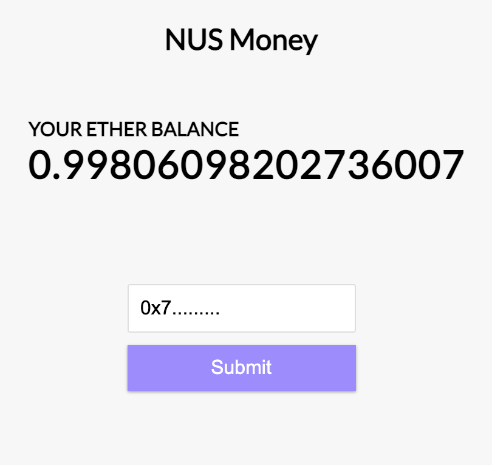
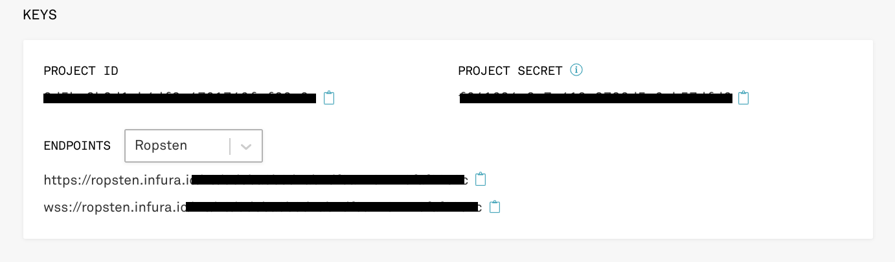

## Web app for Ethereum ##
Purpose is to interact with Ethereum blockchain from Javascript, through Infura.

 
 
### Following are the steps ###
1. Please refer to Infura startup page to get your own Ethereum endpoint.
    For testing purposes, please select Ropsten as the network as shown below.
    
    
    https://blog.infura.io/getting-started-with-infura-28e41844cc89/#step-four-control-how-your-api-can-be-used-enable-your-custom-security-settings- 

2. To get started with web3 library, web3.js is required. Please install in your project with the following methods:
    - npm: `npm install web3`
    - yarn: `yarn add web3`
    - pure js: `link the dist/web3.min.js`
    
    https://web3js.readthedocs.io/en/v1.4.0/getting-started.html

3. Refer to web3 documentation for the function for web3.eth. For this demostration, we have use **getBalance** to return the ether from the requested address.
    
    https://web3js.readthedocs.io/en/v1.4.0/web3-eth.html#getbalance
    
4. Utility functions for Ethereum dapps. We will be using **fromWei** to convert ether from wei to eth.
    
    https://web3js.readthedocs.io/en/v1.4.0/web3-utils.html#fromwei
